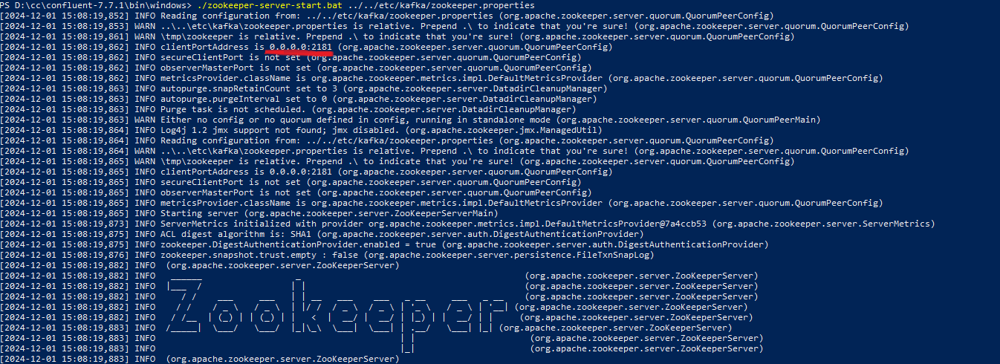
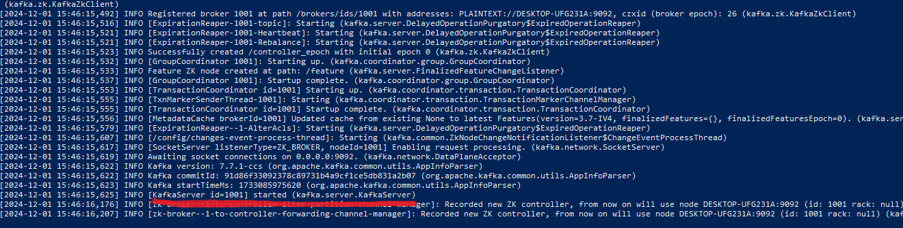
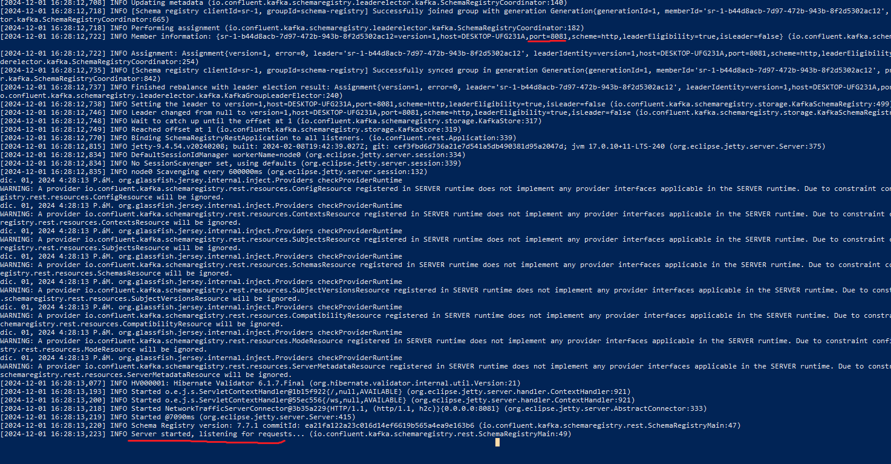
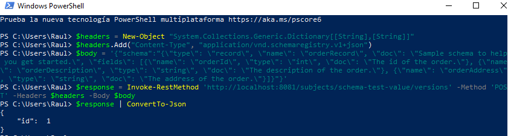

# Kafka with Schema Registry Example

---
Table of Contents
* [Kafka Local](#kakfa-local)
  * [ZOOKEEPER](#zookeeper)
  * [KAFKA SERVER](#kafka-server)
  * [SCHEMA REGISTRY](#schema-registry)
  * [COMANDOS](#comandos)
* [Requirementos](#requirementos)
  * [Kafka](#kafka) 
  * [Java](#java)


---
<a name="kafka-local"/>

# Kafka Local

En este repositorio se hace uso de un entorno local para ejecutar Kafka, Zookepeer y Schema Registry, para su descarga
revisar la sección de requerimientos. A continuación se mostraran los comandos para la ejecución de los componentes:

Ejecutarlos en el orden indicado.

<a name="zookeeper"/>

## ZOOKEEPER

Para ejecutar el zookeeper, abrir Power Shell y dirigirse a la carpeta   
{ruta donde se encuentra los archivos descagados}\confluent-7.7.1\bin\windows 
y ejecutar el siguiente comando:

> ```shell
> ./zookeeper-server-start.bat ../../etc/kafka/zookeeper.properties

Una vez ejecutado debe salir como en la iamgen referencial y escuchar en el puerto 2181



<a name="kafka-server"/>

## Kafka-server

Para ejecutar el Kafka server, abrir Power Shell y dirigirse a la carpeta   
{ruta donde se encuentra los archivos descagados}\confluent-7.7.1\bin\windows
y ejecutar el siguiente comando:

> ```shell
> ./kafka-server-start.bat ../../etc/kafka/server.properties

Una vez ejecutado debe salir como en la iamgen referencial y escuchar en el puerto 9092



*En caso salga un error de tipo timeout for connectiong to zookeeper,
ingresar a ../../etc/kafka/server.properties y setear

```shell
$ zookeeper.connection.timeout.ms=30000
```


<a name="schema-registry"/>

## Schema Registry

Para ejecutar el Kafka server, abrir Power Shell y dirigirse a la carpeta   
{ruta donde se encuentra los archivos descagados}\confluent-7.7.1\bin\windows
y ejecutar el siguiente comando:

> ```shell
> .\schema-registry-start.bat ../../etc/schema-registry/schema-registry.properties

Una vez ejecutado debe salir como en la iamgen referencial y escuchar en el puerto 8081




<a name="comandos"/>

## Comandos

Se listaran los comandos que se usaran en el proyecto.
Para que funcionen los comandos deben permanacer ejecutandose los 3 pasos anteriores.
Los comandos deben ser ejecutados en Power Sheel y desde la ruta  
{ruta donde se encuentra los archivos descagados}\confluent-7.7.1\bin\windows

En caso de error por logs eliminar los mismos (kafka-logs y zookeeper) que se encuentran en la carpeta ../tmp y volver a ejecutar el entorno local.
### Crear Tópico

Se deberá crear el tópico antes de iniciar la aplicación

> ```shell
> ./kafka-topics.bat --bootstrap-server localhost:9092 --create --replication-factor 1 --partitions 3 --topic order-topic

### Eliminación de Tópico

> ```shell
> ./kafka-topics.bat --bootstrap-server localhost:9092 --delete --topic order-topic

### Listar topicos

> ```shell
> ./kafka-topics.bat --list --bootstrap-server localhost:9092

### Descripción de Tópico

> ```shell
> ./kafka-topics.bat --bootstrap-server localhost:9092 --describe --topic order-topic

### Listar contenido del Tópico

Se recomienda abrir 3 Power Shell para visualizar como se va registrando el contenido en el topico,
ejecutar con --partition 0, --partition 1,--partition 2

> ```shell
> ./kafka-console-consumer.bat --bootstrap-server localhost:9092 --topic order-topic --partition 0 --offset 0

### Registrar schema Registry

Se deberá registrar el schema antes de iniciar la aplicación

> ```shell
> $headers = New-Object "System.Collections.Generic.Dictionary[[String],[String]]"
> $headers.Add("Content-Type", "application/vnd.schemaregistry.v1+json")
> 
> $body = '{"schema":"{\"type\": \"record\", \"name\": \"orderRecord\", \"doc\": \"Sample schema to help you get started.\", \"fields\": [{\"name\": \"orderId\", \"type\": \"int\", \"doc\": \"The id of the order.\"}, {\"name\": \"orderDescription\", \"type\": \"string\", \"doc\": \"The description of the order.\"}, {\"name\": \"orderAddress\", \"type\": \"string\", \"doc\": \"The address of the order.\"}]}"}'
> $response = Invoke-RestMethod 'http://localhost:8081/subjects/schema-test-value/versions' -Method 'POST' -Headers $headers -Body $body
> $response | ConvertTo-Json



---

<a name="requirementos"/>

# Requirementos

Lo siguiente es necesario para el funcionamineto de la aplicación y su entorno.

## Kafka

Los comandos se trabajaron con confluent-7.7.1, descargar el .zip y descomprimir.

curl -O https://packages.confluent.io/archive/7.7/confluent-community-7.7.1.zip
https://medium.com/@praveenkumarsingh/confluent-kafka-on-windows-how-to-fix-classpath-is-empty-cf7c31d9c787
git clone https://github.com/confluentinc/schema-registry.git

## Java

* El proyecto esta construido con Java 17, Maven y usando IntellIj
* Por defecto escucha en el puerto 8181.
* Primero se tiene que levantar el entorno local de Kafka
* Seguido ejecutar la creación del tópico y el registro del schema
antes de ejecutar el proyecto.


* Realizar un mvn clean install
* Ejecutar el proyecto.


* Consideraciones
  
  * El producer envia el mensaje de manera aleatoria a uno de los 3 topicos.
  * Se tienen 3 consumers, cada uno escucha el mismo topico pero diferente particion.
  * Los consumer estan configurados para escuchar desde el primer mensaje que se dejo en el topico, offset=0.
  
